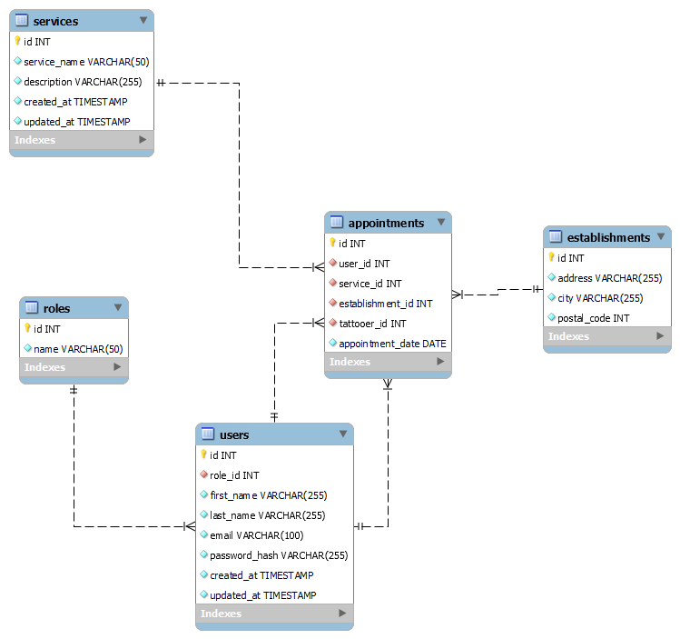

<h1 align="center">
   
  
</h1>

<h4 align="center">API for tattoo shop bussiness</h4>

  <a href="#key-features">Key Features</a> •
  <a href="#project-objective">Project objective</a> •
  <a href="#stack">Stack</a> •
  <a href="#api">API</a> •
  <a href="#future-improvements">Future improvements</a>
  <a href="#support">Support</a> •
  <a href="#you-may-also-like">You may also like...</a>

## Key Features

* Implementation of API REST backend using Express, TypeORM & MySQL
* Identification of users by role to access to the different API consults achieved by tokens using JWT (JSON Web Token)
* Server created with Docker and working with MySQL Workbench
* Encryptation of the user password using bcrypt
* Data simulated with seeders

## Project objective

This API is a project focused on the correct implementation of the methods, structure and parts related to the backend of an application that uses a personalized API REST. Focusing on the bussiness model, this project tries to represent how will be the back-end logic for a tattoo shop bussiness, with the users related to the activity, the services the shop offers to customers, the different establishments the company could have and the main feature: the appointments list creation that the shop offers to the customers. 

## Stack

## API

The API makes a relation between the user and the database that is created for the tattoo company InkMasters. The database that is used to achieve this is represented as the following tables:

    

As the diagram shows, there are 5 tables: roles, users, services, establishments and appointments. For consulting or modifying the content of each one, are used the following endpoints:

### Endpoints and what does each one

On this section, are shown all the endpoints from my API and what does each one, splitted by the differents methods and tables that are related with the consult. <b>IMPORTANT</b>: The super_admin restricted methods are only usable if a user from the DB has logged in using the /auth/login method and has assigned that role, generating a JWT token saved on the request at the tokenData object inside it. If you are using some applications like Postman to check that security, you have to copy paste it inside the Bearer Token Authorization tab.

#### Auth table

| METHOD     | URL                      | Description                                                             |
| ---------- | ------------------------ | ----------------------------------------------------------------------- |
| `POST`     |`/api/auth/register`      | Register method to create an user (by default, will have the user role) |                    
| `POST`     |`/api/auth/login`         | Login a user into the service                                           |

#### Roles table

| METHOD     | URL                       | Description                                                            |
| ---------- | ------------------------- | ---------------------------------------------------------------------- |
| `GET`      |`/api/roles`               | Get all roles from DB (only for super_admin users)                     |
| `POST`     |`/api/roles`               | Post a role into DB (only for super_admin users)                       |
| `UPDATE`   |`/api/roles/{id}`          | Update a role by ID into DB (only for super_admin users)               |
| `DELETE`   |`/api/roles/{id}`          | Delete a role by ID from the DB (only for super_admin users)           |

#### Users table

| METHOD     | URL                       | Description                                                            |
| ---------- | ------------------------- | ---------------------------------------------------------------------- |
| `GET`      |`/api/users`               | Get all users from DB (only for super_admin users)                     |
| `GET`      |`/api/users/profile`       | Get profile from user logged into the API                              |
| `UPDATE`   |`/api/users/profile`       | Update profile from user logged into the API                           |
| `UPDATE`   |`/api/users/{id}/role`     | Update a role from user by ID into DB (only for super_admin users)     |
| `DELETE`   |`/api/users/{id}`          | Delete a user by ID from the DB (only for super_admin users)           |

#### Services table

| METHOD     | URL                       | Description                                                            |
| ---------- | ------------------------- | ---------------------------------------------------------------------- |
| `GET`      |`/api/services`            | Get all services from DB                                               |
| `POST`     |`/api/services`            | Post a service into DB (only for super_admin users)                    |
| `UPDATE`   |`/api/services/{id}`       | Update a service by ID into DB (only for super_admin users)            |
| `DELETE`   |`/api/services/{id}`       | Delete a service by ID from the DB (only for super_admin users)        |

#### Establishments table

| METHOD     | URL                       | Description                                                            |
| ---------- | ------------------------- | ---------------------------------------------------------------------- |
| `GET`      |`/api/establishments`      | Get all establishments from DB                                         |
| `POST`     |`/api/establishments`      | Post an establishment into DB (only for super_admin users)             |
| `UPDATE`   |`/api/establishments/{id}` | Update an establishment by ID into DB (only for super_admin users)     |
| `DELETE`   |`/api/establishments/{id}` | Delete an establishment by ID from the DB (only for super_admin users) |

#### Appointments table

| METHOD     | URL                      | Description                                                            |
| ---------- | ------------------------ | ---------------------------------------------------------------------- |
| `GET`      |`/api/appointments`       | Get all appointments from user logged from DB                          |
| `GET`      |`/api/appointments/{id}`  | Get an appointments from DB                                            |
| `POST`     |`/api/appointments`       | Post an appointment into DB                                            |
| `UPDATE`   |`/api/appointments`       | Update an appointment into DB                                          |

## Future improvements

⬜ Implementing front-end to use the API
 
⬜ Implementing Tattoes / Piercings / Dilators entities and his reference into DB
 
⬜ Making some restrictions for each role (concretely, the tattoer to get his appointments)
 
⬜ Splitting the different validations inside functions

## Support

## You may also like...

- [Between Sins](https://gitlab.com/daghdha1/betweensins) - RPG videogame 
- [Mars Alienated](https://gitlab.com/AdrianGarciaAndreu/mars-alienated-rv-htc) - VR escape room experience in a space station

